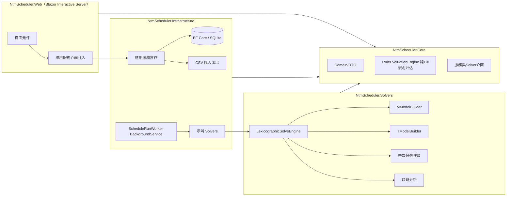
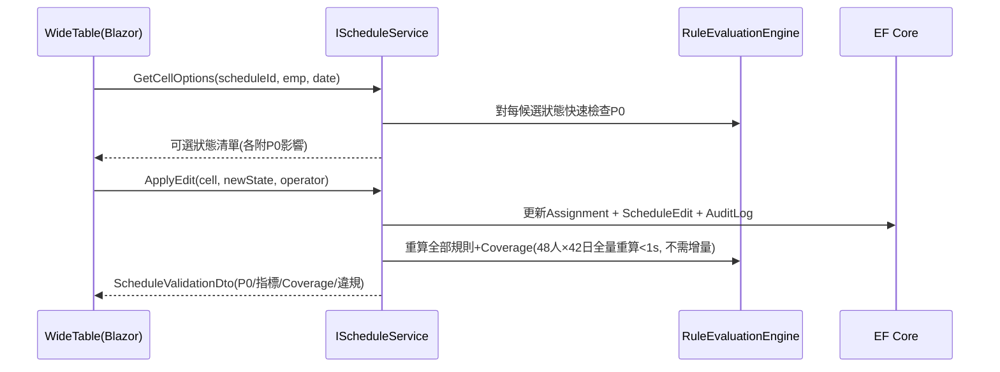

> **狀態註記（D-20，2026-08-05）**：流程已改為「候選 → 目前班表」，不再有 Draft／Publish。
> 下文若仍出現舊名稱，以本註記與 `docs/10-decisions.md` D-20、`docs/01`、`docs/08` 為準。
> 實體為 `MonthSchedule`／`ScheduleEdit`／`ScheduleSnapshot`；服務為 `IScheduleService`（含選候選、編輯、驗證、快照）。

# 排班系統實作設計

規格來源：

- **唯一真相來源**：[AGENTS.md](AGENTS.md) 與 [docs/](docs/01-scope-and-workflow.md) 各章 Markdown。
- **原始規格書**：[docs/新北捷人員排班系統_完整開發規格書_v6.pdf](docs/新北捷人員排班系統_完整開發規格書_v6.pdf)，實作時應一併參考、交叉比對。若 PDF 與 Markdown 或 [docs/10-decisions.md](docs/10-decisions.md) 衝突，**以 Markdown 與決策紀錄為準**（部分決策如 D-13 刻意取代 PDF 的說法）；發現文件都沒涵蓋的缺口則回報，不得自行假設。

實作開始時的文件同步：將本計畫存為 `docs/11-implementation-plan.md`；在 [docs/10-decisions.md](docs/10-decisions.md) 追加 D-15（服務層取代 REST）、D-16（UI 用 Blazor 內建＋Bootstrap、測試用 MSTest＋Playwright、CSV 自製 parser）、D-17（固定事件彼此使 P0 必然違反時於輸入驗證擋下，`docs/03` 第 6 節增補第 14 條）；把 PDF 納入版控，並更新 AGENTS.md 的規格書連結指向 `docs/` 內路徑。

## 1. 架構總覽與技術選型




技術選型（僅 Microsoft/Google 套件）：

- `Google.OrTools`（CP-SAT）、`Microsoft.EntityFrameworkCore.Sqlite`、`Microsoft.EntityFrameworkCore.Design`。
- 測試：**MSTest**（xUnit/NUnit 非 Microsoft 套件，不用）；E2E 用 `Microsoft.Playwright.MSTest`。
- **CSV 解析自行實作**（CsvHelper 是第三方）：`Infrastructure/Csv/CsvReader.cs`、`CsvWriter.cs`，支援雙引號跳脫、欄內逗號、UTF-8 BOM。
- UI：Blazor 內建元件＋範本自帶 Bootstrap；不引入 MudBlazor 等第三方元件庫。寬表為自製元件。
- 時間一律台北時間，DB 存 local `DateTime`／`DateOnly`（無 UTC 轉換）；月份存 `"yyyy-MM"` 字串，Domain 用 `YearMonth` struct。

## 2. 方案與資料夾結構

```text
NtmScheduler.sln
src/NtmScheduler.Core/
  Domain/            Unit.cs, ShiftType.cs, DayState.cs, EmployeeInfo.cs, XEvent.cs,
                     YearMonth.cs, SchedulePeriod.cs, CycleInfo.cs, StationConfig.cs
  Calendar/          ScheduleCalendar.cs（排班區間/延伸日/週界）, CycleResolver.cs
  Evaluation/        ScheduleContext.cs, IRuleEvaluator.cs, RuleResult.cs, ViolationItem.cs,
                     RuleEvaluationEngine.cs, SegmentExtractor.cs, BlockExtractor.cs,
                     Rules/Hard/  GenH01..GenH05, MH01..MH03, TH01（共 9 個）
                     Rules/Soft/  GenR01, MsExt, MsHome, TsAttend, TsSpecialty, TsAbility,
                                  GenSStreak, MsBlock, MsNightEarly, MsNightAfternoon,
                                  MsRestSwitch, MsRotate, TsMonthRest, TsMonthBalance,
                                  GenSWeekdayR, GenSWeekendR, MsSupportFair（共 17 個）
  Validation/        InputValidator.cs, ValidationError.cs（14 條 INVALID_INPUT）
  Abstractions/      ISolveService.cs 及第 7 節全部服務介面, DTO/
src/NtmScheduler.Solvers/
  SolveService.cs（ISolveService 實作、狀態機）
  LexicographicSolveEngine.cs, SolveBudget.cs
  M/MModelBuilder.cs   T/TModelBuilder.cs
  Common/RestGapAnalyzer.cs（11 小時禁止對）, PatternEncoder.cs（區段/序列 pattern）,
         BlockCounterEncoder.cs, FairnessEncoder.cs, DiversityEncoder.cs
  ShortageAnalyzer.cs, TConflictSummarizer.cs
src/NtmScheduler.Infrastructure/
  Data/NtmDbContext.cs, Entities/, Migrations/
  Services/（第 7 節各介面實作）
  Csv/, Background/ScheduleRunWorker.cs, Auditing/AuditWriter.cs
src/NtmScheduler.Web/
  Components/Layout/（含 OperatorBox）
  Components/Pages/（第 9 節各頁）
  Components/Shared/WideTable.razor, ViolationPanel.razor, CoveragePanel.razor,
                    CellEditorPopover.razor, MetricsCompareTable.razor
tests/NtmScheduler.Tests/
  Core/, Solvers/, Integration/, E2E/
  TestData/SampleDataFactory.cs
```

## 3. Core：領域模型與規則評估引擎

### 3.1 關鍵型別（簽章）

```csharp
enum Unit { M, T }
enum ShiftType { Morning, Afternoon, Night }              // 早/午/夜
enum DayStateType { Shift, Rest, RStar, HolidayRest, X, Unassigned }
// Rest=R、RStar=已滿足R*、HolidayRest=R1（國定假日休假，不重置GEN-H-02計數，見docs/04）
readonly record struct DayState(DayStateType Type, ShiftType? Shift = null, string? Station = null);
// M 正常班: (Shift, Morning, "LB03")；T 正常班: (Shift, Night, null)；休假: (Rest)…

readonly record struct YearMonth(int Year, int Month);    // Parse("2026-08")/ToString()
record SchedulePeriod(YearMonth TargetMonth, DateOnly FirstDay, DateOnly MonthEnd, DateOnly RangeEnd);
// RangeEnd = 月底所在週(週一起算)的星期日；ExtensionDays = (MonthEnd, RangeEnd]

record EmployeeInfo(string Id, string Name, Unit Unit,
                    string? HomeStation, string? Specialty, int? Ability);
record XEvent(string EmployeeId, DateTime Start, DateTime End, string Description);
record CycleInfo(DateOnly Start, DateOnly End, int RequiredR, int RequiredR1);
// RequiredR=一般休假(R+R*)需求，預設16；RequiredR1=該週期國定假日數（R1需求）

record EmployeeHistory(
    IReadOnlyDictionary<DateOnly, DayState> Days,   // 週期起始日~區間前一日
    DateTime? LastWorkEnd,                          // 上一次實際工作結束時間
    (ShiftType Shift, int Count)? OpenBlock);       // M 未結束同班別區塊
```

固定設定 `StationConfig`／`ShiftTimeConfig`（Core 常數＋可由 appsettings 覆寫）：
車站群組 A=LB01–03、B=LB04–06、C=LB07–09、D=LB10–12；夜班站 LB01/06/08/12；
外派站 LB02/04/11；M 班別 06:30–14:30／14:20–22:20／22:00–翌日07:00；
T 班別 07:00–15:00／15:00–23:00／23:00–翌日07:00。

### 3.2 RuleEvaluationEngine（唯一權威違反量實作）

```csharp
interface IRuleEvaluator {
    string RuleId { get; }
    RuleResult Evaluate(ScheduleContext ctx);      // count + items
}
record RuleResult(string RuleId, int ViolationCount, IReadOnlyList<ViolationItem> Items);
record ViolationItem(string RuleId, string? EmployeeId, DateOnly? Date, string Message); // 白話訊息
```

- `ScheduleContext`：period、unit、employees、cycles、histories、xEvents、
`assignments[employeeId][date] -> DayState`、T 月班組、固定設定。由 Candidate／目前班表／快照皆可建構。
- **9 個硬規則 checker 也是 evaluator**（目前班表驗證與 P0 檢查用同一套）。
- `SegmentExtractor`／`BlockExtractor` 回傳「已結束區段（含起訖日與長度）＋月底尾端（長度）」，
嚴格依 [docs/05-soft-rules.md](docs/05-soft-rules.md) 第 7 節（D-13）：尾端不計短、計 `max(0, L−5)` 超額；月初承接歷史。
- Coverage 計算器：M `CoverageCalculator`（每站每日每班 required/assigned/external/unassigned）、
T `TCoverageCalculator`（每日每班 group_size/normal_attend/attend_target/avg_ability/missing_specialties）。

### 3.3 InputValidator（14 條）

實作 [docs/03-data-and-validation.md](docs/03-data-and-validation.md) 第 6 節 13 條，外加第 14 條（D-17）：
**固定事件彼此（X↔X、X↔Published 歷史）依班別實際時間必然違反 GEN-H-03/GEN-H-02 時**，
直接回 `INVALID_INPUT` 並指出兩筆衝突來源，不進求解器。
每條錯誤輸出 `ValidationError(Code, EmployeeId?, Date?, Message)`，Code 如 `E07_RSTAR_EXCEEDS_REQUIRED_R`。

## 4. 資料層（EF Core 實體欄位）

- `Employee`：`Id`(PK, string)、`Name`、`Unit`、`HomeStation?`、`Specialty?`、`Ability?`。
- `EmployeeMonthlyShift`：PK(`EmployeeId`,`Month`"yyyy-MM")、`Shift`。
- `FixedEvent`：`Id`、`EmployeeId`、`Type`(RStar/X)、`Date?`(R)、`Start?`/`End?`(X)、`Description?`。
- `ScheduleCycle`：`Id`、`Start`、`End`、`RequiredR`（一般休假，預設 16）、`RequiredR1`（國定假日數）。
- `ScheduleRun`：`Id`、`Unit`、`TargetMonth`、`Status`(Queued/Running/Completed/Failed)、
`ScheduleStatus?`(FEASIBLE/INFEASIBLE/INVALID_INPUT)、`OptimizationStatus?`(OPTIMAL/TIME_LIMIT)、
`Seed`、`ProgramVersion`、`Operator`、`CreatedAt`、`SnapshotJson`（完整 SolveRequest 序列化）、`ProgressJson`。
- `CandidateSolution`：`Id`、`RunId`、`Index`(1–3)、`IsShortageAnalysis`(bool)、`MetricsJson`（每規則違反量＋Coverage 摘要＋差異率）。
- `Assignment`：`Id`、`OwnerType`(Candidate/Schedule/Snapshot)、`OwnerId`、`EmployeeId`、`Date`、
`State`（顯示字串）；索引 (`OwnerType`,`OwnerId`,`EmployeeId`,`Date`) unique。
- `MonthSchedule`：`Id`、`Unit`、`Month`、`SourceRunId?`、`SourceCandidateId?`、`UpdatedAt`、`Operator`；
同 (Unit,Month) 唯一；`ScheduleEdit`：`Id`、`ScheduleId`、`Seq`、`EmployeeId`、`Date`、`BeforeState`、`AfterState`、`Operator`、`At`（供復原與稽核）。
- `ScheduleSnapshot`：`Id`、`Unit`、`Month`、`VersionNo`、`CreatedAt`、`Operator`、`IsCurrent`；
歷史匯入或手動快照；可還原為目前班表。
- `RuleSetting`：`Id`、`Unit`、`RuleId`、`Priority`(0–4)、`Enabled`、`Order`、`ParametersJson`。
- `AuditLog`：`Id`、`At`、`Operator`、`Action`、`TargetType`、`TargetId`、`BeforeJson?`、`AfterJson?`。

Migration 用 SQLite 產生；禁 provider 專屬語法（供日後切 PostgreSQL/SQL Server）。

## 5. Solvers：CP-SAT 模型（核心）

### 5.1 變數

- **M**（規模：48 人 × ≤42 日 × 每日 ≤11 狀態 ≈ 2 萬布林，CP-SAT 輕鬆處理）：
  - `x[e,d,st,s]`：e 在日 d 於車站 st 上班別 s。st 限 e 的同群組車站；s 限該站班別（夜班只在 LB01/06/08/12）。
  - `rest[e,d]`：一般休假（R 與已滿足 R\* 共用此變數——「計入一般休假額度」的語意天然一致）。
  - `r1[e,d]`：R1 國定假日休假。**獨立變數，不可與 rest 合併**——兩者對 GEN-H-02 效果不同（docs/04）。
  - 每格 exactly-one：`Σ_st,s x + rest + r1 == 1`；X 日與已發布日**不建變數**，以常數代入所有相關約束（GEN-H-01/H-05）。
  - `ext[st,d,s]`：外派，僅 LB02/LB04/LB11。班位覆蓋（M-H-02）：對每班位 `Σ_e x[e,d,st,s] + ext[st,d,s] == 1`（嚴格模型無 slack；rest/r1/X 都不補班位）。
- **T**：班別由當月班組固定（T-H-01），每人每日 `work[e,d] + rest[e,d] + r1[e,d] == 1`（X/已發布日為常數）。
延伸日班別＝下月班組資料優先、否則輪轉推算（D-14c）。

### 5.2 P0 編碼

- **GEN-H-02**（R1 不重置計數，**不可**用固定 7 日滑動窗——含 R1 時會漏抓，見 docs/04）：
  每人每日「連續工作計數器」IntVar `cw[e,d]`∈[0,6]，通道約束（OnlyEnforceIf）：
  `rest=1 → cw=0`；`r1=1 → cw=cw[d−1]`；工作日（早/午/夜/X）→ `cw=cw[d−1]+1`。
  初值由歷史用同一遞迴算出（歷史 R1 同樣不重置）；domain 上限 6 即為硬限制。
- **GEN-H-03（11 小時）**：`RestGapAnalyzer` 在建模時從設定的班別時間**通用計算**禁止對，不寫死：
對 ±2 日內任兩個候選工作區間，若間隔 < 11h → `AddBoolOr(¬a, ¬b)`。
以目前班表時間推得的具體結果（測試基準）：
  - M：`午(d)→早(d+1)`(8h10)、`夜(d)→早(d+1)`(重疊)、`夜(d)→午(d+1)`(7h20) 禁止；其餘正常班對合法。
  - T：`午(d)→早(d+1)`(8h)、`夜(d)→早(d+1)`(0h)、`夜(d)→午(d+1)`(8h) 禁止；同班別連續皆 16h 合法
  →T 的 11h 實際只在**跨月輪轉交界**與 **X 事件**附近起作用。
  - X 用實際起訖時間對前後候選狀態逐一判斷；月初第一天用歷史 `LastWorkEnd`。
- **GEN-H-04**（兩個額度分開限制＋跨月比例保留，完整定義見 docs/04 GEN-H-04(a)(b)(c)）：
  對每個相交週期、每人（歷史日為常數）建三組線性約束：
  1. 一般休假：週期在區間內結束→`Σ rest == RequiredR`；未結束→`Σ rest ≤ RequiredR`。
  2. R1：週期在區間內結束→`Σ r1 == RequiredR1`；未結束→`Σ r1 ≤ RequiredR1`。
  3. 未結束時可補足：`(RequiredR − Σ rest) + (RequiredR1 − Σ r1) ≤ 區間後剩餘天數`。
  4. **跨月比例保留（D-19，只限 rest）**：若週期結束日 > 目標月底，
     `Σ rest(日期 ≤ 月底) ≤ RequiredR − ceil(RequiredR × futureDays / cycleDays)`，
     `futureDays`＝週期在月底後的天數（常數，建模時算好）；r1 不納入此式；
     延伸日的 rest 不在此和內（只算 ≤ 月底）。
  **不得**把 rest 與 r1 合併成單一「總休假 == RequiredR + RequiredR1」約束。
- **M-H-01**：跨群組變數不建立（結構性保證）。**M-H-03**：`ext` 只建三站。

### 5.3 軟規則編碼（每條一個 IntVar 違反量；計分範圍一律照 D-13：只計目標月份日期）

- **GEN-R-01**：`Σ (1 − rest[e,d])`，逐筆 R。
- **M-S-EXT**：`Σ ext`。**M-S-HOME**：`Σ x[e,d,st≠home,s]`。
- **T-S-ATTEND**：每（日,班組）`short ≥ floor(n/2) − Σ work`、`short ≥ 0`，Σshort。
- **T-S-SPECIALTY**：每（日,班,非空專業）`miss = NOT OR(該專業成員 work)`，Σmiss。
- **T-S-ABILITY**：每（日,班）`def ≥ 3·Σwork − Σ(ability_e·work_e)`、`def ≥ 0`，Σdef。
- **M-S-NIGHT-EARLY/AFTERNOON**：對每三連日 (d,d+1,d+2)（早/午日在目標月內；d 可為歷史常數）：
reified AND(夜@d, rest@d+1, 早/午@d+2) 指標相加。中間日**只認 rest**（`夜,R1,早` 不計，D-18）。
- **M-S-RESTSWITCH／M-S-ROTATE**（共用「有效正常班相鄰對」編碼）：
對每對日 (d1<d2)（d1 可為歷史）：輔助布林 `noNormalBetween[d1,d2]` = AND(中間每日為 rest、r1 或固定 X)；
`hasRestBetween` = OR(中間 rest)（**不含 r1**——換班只隔 R1 仍算 RESTSWITCH 違反，D-18）。對每組班別 (s1≠s2)：
RESTSWITCH 指標 = AND(shiftIs(d1,s1), shiftIs(d2,s2), noNormalBetween, NOT hasRestBetween)；
ROTATE 指標 = AND(shiftIs(d1,s1), shiftIs(d2,s2), noNormalBetween) 且 (s1→s2) ∉ {早→午,午→夜,夜→早}。
`shiftIs(d,s)` M 為 OR over 車站。違反量歸屬 d2，只計 d2 ≤ 月底。
- **GEN-S-STREAK**：GEN-H-02 保證區段長 ≤ 6，故 `D(L)` 只在 L∈{1,2,6} 非零 →
違反量 = 2×(恰 1 段數) + 1×(恰 2 段數) + 1×(恰 6 段數)。
以 pattern 視窗偵測「邊界,工作^k,邊界」（邊界＝rest **或 r1**（任何休假都結束區段，D-18）／歷史休假常數；月初含歷史前綴）。
月底尾端：若月底當日仍在工作 → 該段不計短，只加 `max(0, 至月底長度 − 5)`。
- **M-S-BLOCK**（`BlockCounterEncoder`，正確性熱點）：每人每日通道約束：
`blockShift[e,d]`∈{0=無,1早,2午,3夜}、`blockLen[e,d]`∈[0,62]：
無正常班日（R/R\*/R1/X）→ 兩者沿用前日（R1 與 R 一樣不切斷區塊，D-18）；有正常班 s 且 s==blockShift[d−1] → len+1；
否則（換班別或首次）→ 記「區塊關閉事件」以 `AddElement(D表, blockLen[d−1])` 計分（僅 d ≤ 月底），並重設 len=1。
初值來自歷史 `OpenBlock`；月底再加 `max(0, blockLen[月底] − 5)` 尾端超額。
D 表：`D[L]=max(0,3−L)+max(0,L−5)`，`D[0]=0`。
- **公平性三條**：每（群體,相交週期）建 `AddMaxEquality/AddMinEquality` 於各員的計數和
（平日/週末 rest 數或非本站工作日數；**只算 rest，不含 r1**（D-18）；歷史日常數＋目標月變數；延伸日不計），違反量 = Σ(max−min)。

### 5.4 逐條字典序引擎與候選

```text
Solve(request):
  budget = Stopwatch + TotalTimeLimit(預設300s)
  model = 變數 + 全部P0
  incumbent = null; opt = OPTIMAL
  for rule in request.Rules(啟用, 依order):
      status = solver.Minimize(rule.Objective, time=budget.Remaining)
      if 無解:
          if rule是第一條且無incumbent -> INFEASIBLE: M→ShortageAnalyzer / T→TConflictSummarizer; return
          else 不可能(P0未變) -> assert
      incumbent = solution
      if status==OPTIMAL: model.Add(obj == value); progress回報「rule完成」
      else: model.Add(obj == incumbentValue); opt=TIME_LIMIT; break   // 停止更低順位
  candidates = [incumbent]
  denom = 目標月內可決定格數(排除固定X/已發布) ; th = ceil(denom * 0.10)
  for k in 2..3:
      foreach c in candidates: model.Add(Σ diffLit(c) >= th)
      // diffLit: rest格 -> (1-rest[e,d]) ; r1格 -> (1-r1[e,d]) ; 工作格(st,s) -> (1-x[e,d,st,s])
      // R與R*同視為rest；R1是獨立狀態，R↔R1也算差異（docs/06）
      status = solver.Solve(time=budget.Remaining, 無目標)   // 品質已全數固定
      if 有解: candidates.Add(solution) else break
  對每份候選跑 RuleEvaluationEngine 重算全部指標，必須與模型目標值一致(assert)，寫入 MetricsJson
```

- **缺班分析（僅 M）**：新模型，班位覆蓋改 `Σx + ext + slack == 1`，`Minimize Σslack`，其餘 P0 不變；
結果存成 `CandidateSolution(IsShortageAnalysis=true)`，UI 唯讀。
- **T 衝突摘要**（D-11）：輸出各週期 requiredR 與可休天數統計、各班組人數、R 總數與文字說明。
- **可重現性**：`random_seed = run.Seed`、`num_search_workers` 固定於設定；README 註明嚴格重現需 deterministic time。
- **進度**：`IProgress<SolveProgress>`（目前規則、已完成清單、objective bound）→ Worker 每 2 秒節流寫 `ProgressJson`。

## 6. 後端 API（服務層介面；定義於 Core/Abstractions，實作於 Infrastructure/Services）

不做 HTTP REST（Blazor Server 直接注入）；未來接 AD／外部系統再加 Minimal API。全部方法 async。

```csharp
interface IEmployeeService {
    Task<IReadOnlyList<EmployeeInfo>> ListAsync(Unit unit);
    Task UpsertAsync(EmployeeInfo e, string op); Task DeleteAsync(string id, string op);
    Task<ImportResult> ImportCsvAsync(Unit unit, Stream csv, string op);
}
interface IMonthlyShiftService {
    Task<IReadOnlyDictionary<string, ShiftType>> GetMonthAsync(YearMonth m);
    Task UpsertAsync(string empId, YearMonth m, ShiftType s, string op);
    Task<ImportResult> ImportCsvAsync(Stream csv, string op);
}
interface IEventService {  // 寫入前先跑 InputValidator 相關條目
    Task<IReadOnlyList<FixedEventDto>> ListAsync(Unit unit, YearMonth m);
    Task<ValidationError[]> AddRStarAsync(string empId, DateOnly date, string op);
    Task<ValidationError[]> AddXAsync(XEvent x, string op);
    Task DeleteAsync(long eventId, string op);
    Task<ImportResult> ImportCsvAsync(Stream csv, string op);
}
interface IScheduleCycleService { Task<IReadOnlyList<CycleInfo>> ListAsync(); Task UpsertAsync(...); }
interface IRuleSettingService {
    Task<IReadOnlyList<RuleSettingDto>> GetAsync(Unit unit);
    Task UpdateAsync(Unit unit, IReadOnlyList<RuleSettingDto> ordered, string op); // P0/P1不可動
}
interface IScheduleRunService {
    Task<CreateRunResult> CreateAsync(Unit unit, YearMonth m, string op);
    // CreateRunResult = RunId 或 ValidationError[]（INVALID_INPUT 即不建 run）
    Task<RunProgressDto> GetProgressAsync(long runId);   // 狀態+目前規則+已完成+候選數
    Task<IReadOnlyList<RunSummaryDto>> ListAsync(Unit unit);
}
interface ICandidateService {
    Task<IReadOnlyList<CandidateDto>> GetAsync(long runId);
    Task<CandidateCompareDto> CompareAsync(long runId);  // 規則×候選矩陣+差異率+Coverage
}
interface IScheduleService {
    Task<WideTableDto?> GetCurrentAsync(Unit unit, YearMonth m);
    Task<long> SelectCandidateAsync(long candidateId, string op);  // 取代為目前班表
    Task<IReadOnlyList<CellOptionDto>> GetCellOptionsAsync(long scheduleId, string empId, DateOnly d);
    Task<ScheduleValidationDto> ApplyEditAsync(long scheduleId, string empId, DateOnly d, DayState s, string op);
    Task<ScheduleValidationDto> UndoAsync(long scheduleId, string op);
    Task<ScheduleValidationDto> RevalidateAsync(long scheduleId);
    Task<long> SnapshotAsync(long scheduleId, string op);
    Task RestoreSnapshotAsync(long snapshotId, string op);
    Task<IReadOnlyList<VersionDto>> GetSnapshotsAsync(Unit unit, YearMonth m);
    Task<WideTableDto> GetSnapshotAsync(long snapshotId);  // 唯讀
}
interface IHistoryImportService { Task<ImportResult> ImportAsync(Stream scheduleCsv, Stream? eventsCsv, string op); }
interface IExportService {  // 格式見 docs/06 第5節
    Task<byte[]> ScheduleCsvAsync(OwnerRef solution);
    Task<byte[]> CoverageCsvAsync(OwnerRef solution);   // M: coverage.csv / T: t_coverage.csv
    Task<byte[]> ViolationsCsvAsync(OwnerRef solution);
    Task<string> ResultJsonAsync(long runId);
}
interface IShortageAnalysisService { Task<ShortageDto?> GetAsync(long runId); }
interface IAuditService { Task<IReadOnlyList<AuditLogDto>> QueryAsync(AuditQuery q); }
```

關鍵 DTO：`WideTableDto`（rows: 員工＋`RestStats`＋逐日 `CellDto(state, isExtensionDay, isEditable, violationRuleIds[])`）、
`CellOptionDto(state, p0ViolationsIfApplied[])`、
`ScheduleValidationDto(p0Passed, ruleMetrics[], coverage, violations[])`。

### 目前班表編輯流程



目前班表允許存入 P0 違規（暫存），頁面立即標示未通過並列出原因；無發布關卡。

## 7. 前端頁面（Blazor Interactive Server）

- `/`：**儀表板**。單位＋目標月選擇器；準備完整度卡片；「載入範例資料」；最近 Run 列表。
- `/employees`：M/T 兩分頁 grid（新增/編輯/刪除、CSV 匯入含逐列錯誤報告）；T 分頁含 ability 1–5 驗證。
- `/employees/shifts`：T 月班組矩陣（人×月），顯示輪轉建議值、可覆寫（D-14c 例外資料）。
- `/events`：R/X 清單（篩選單位/月份/人員）；新增表單即時回 `ValidationError`；CSV 匯入。
- `/cycles`：8 週週期表維護（requiredR 預設 16、requiredR1＝國定假日數），顯示每週期天數與額度合理性提示。
- `/rules`：兩單位分頁；P0 列鎖定圖示、P1 固定；P2–P4 列可啟用/停用/上移/下移/參數編輯（寫回 `RuleSetting`）。
- `/runs`、`/runs/{id}`：建立 Run（若 INVALID_INPUT 直接顯示錯誤清單）；進度頁 2 秒輪詢 `GetProgress`：
規則進度列（已完成✓/處理中/未處理）、OPTIMAL/TIME_LIMIT 徽章、候選數、INFEASIBLE 時導向缺班分析或衝突摘要。
- `/runs/{id}/candidates`：`MetricsCompareTable`（規則×候選違反量、差異率、Coverage 摘要）；「選為目前班表」。
- `/schedules/{unit}/{month}`：**互動寬表（核心頁）**。
  - `WideTable`：CSS sticky 員工欄＋日期表頭；48×42 規模直接全渲染（約 2000 格，無需虛擬化，用 `@key` 控 diff）；
  站別/群組/班組/姓名篩選；延伸日欄位灰底＋標頭標記；X 格 tooltip 顯示完整起訖與說明。
  - 點格 → `CellEditorPopover` 呼叫 `GetCellOptions`，選項附 P0 影響警示；修改即呼叫 `ApplyEdit`。
  - `ViolationPanel`：依 Rule ID 分組的白話清單，點項目捲動並高亮對應格（**不得只靠顏色**，格上加圖示＋title）。
  - `CoveragePanel`：M 站×日×班缺額矩陣；T 每日每班出勤/專業/平均能力；
  休假統計（docs/08）：每人本月 R+R\*、本月 R1、週期累積 R+R\*/16、累積 R1/requiredR1、
  月底後應保留的 R+R\* 數（reservedGeneralRest）。
  - P0 狀態徽章、Undo、可選「建立快照」。
- `/versions`：單位×月快照鏈；目前／歷史標記；舊版開唯讀寬表；還原為目前班表。
- `/runs/{id}/shortage`：缺班分析唯讀寬表＋缺額 Coverage，明顯「不可選為目前班表」橫幅。
- `/import`：歷史匯入與 CSV 選用工具（schedule.csv＋events.csv、範本／預覽）。
- `/audit`：稽核查詢（時間/操作者/動作篩選）。
- Layout：頂欄 `OperatorBox`（目前操作者，存 localStorage，寫入所有服務呼叫的 `op` 參數，D-04）。

## 8. 背景執行管線

- `ScheduleRunWorker : BackgroundService`：迴圈取最舊 Queued run → 標 Running →
反序列化 `SnapshotJson` 為 `SolveRequest` → `ISolveService.Solve(progress, ct)` →
寫入 Candidates/Shortage/狀態。一次一個；例外 → 標 Failed＋錯誤訊息。
- 啟動時把殘留 Running 重設為 Queued（依快照重跑，AC-23）。
- `CreateAsync` 流程：InputValidator → 通過才組 SolveRequest 快照（人員/事件/歷史截止點/固定設定/規則順序/seed/程式版本）存 DB。

## 9. 測試策略與 AC 對映

- **Core 單元測試**（M2）：曆法（AC-01）、區段（AC-02）、區塊（AC-03）、11h 分析器（AC-04）、
各 evaluator 數值案例（AC-06、07、21）、D-13 尾端（AC-25）、InputValidator（AC-12、13、14、19）、
**GEN-H-02 的 R1 語意**：R 重置（AC-26）、R\* 重置（AC-27）、`早早早R1午午午` 後再排工作違反（AC-28）。
- **Solver 測試**（M4）：小規模（2 站 6 人／T 1 組 6 人）可人工驗證的定案 fixture；
合法性（AC-05、15、16、18）、缺班分析（AC-10）、候選數（AC-08）、TIME_LIMIT 行為（AC-22，把時限設 1ms 觸發）、
公平性跨週期（AC-17）、**R1 額度與比例保留**：R1 可排非國定假日（AC-29）、完整週期 R+R\* 恰 16（AC-30）、
R1 恰等於 requiredR1（AC-31）、月底後剩 14 天保留 4 個一般休假（AC-32）、延伸日 R 不消耗本月上限（AC-33）、
**每份候選：模型目標值 == evaluator 重算值**（全規則交叉核對，最重要的守門測試）。
- **整合測試**（M3/M5）：SQLite in-memory；CSV 匯入匯出 round-trip（**R1 保持 R1 不得變 R，AC-34**）；
Worker 重啟復原（AC-23）；快照／還原（對應原 AC-24 語意，見 D-20）。
- **E2E**（M7，Playwright）：主流程「載入範例→建 Run→看候選→選為目前班表→改格造成缺班（AC-09）→修復」；
未滿足 R 顯示（AC-20）。
- 測試命名含 AC 編號（如 `AC04_AfternoonToMorning_Forbidden`），CI 指令 `dotnet test`。

## 10. 樣本資料產生器（`SampleDataFactory`）

- 固定 seed 決定性產生：M 48 人（每站 4 人；夜班站優先）＋ T 30 人（三班組各 10，
specialty 取樣自{軌道,號誌,電力,空白}、ability 1–5）；2026 全年 8 週週期表
（requiredR=16；requiredR1 依各週期實際國定假日數，樣本涵蓋 0 與 2 的週期各至少一個）。
- 歷史：以規則感知的簡單輪轉樣板直接合成 8 週合法歷史（含若干 `R1` 日，供 AC-34 與
GEN-H-02 接續測試），**用 RuleEvaluationEngine 驗證 P0 全過**後輸出成
`schedule.csv`＋`events.csv`（同時當 `/import` 的 E2E 素材與 README 範例）。

## 11. 里程碑與完成定義（每個里程碑一個 commit，可獨立驗收）

1. **M1 骨架**：solution＋五專案＋套件引用＋空 DbContext＋`dotnet build` 全綠；
  Core 不參考 OR-Tools/EF 由專案檔保證。
2. **M2 Core**：3.1–3.3 全部型別、26 個 evaluator、InputValidator；第 9 節 Core 單元測試全綠。
3. **M3 資料層**：第 4 節實體＋migration＋CSV 讀寫＋歷史匯入＋稽核；整合測試 round-trip 全綠。
4. **M4 Solvers**：第 5 節全部；小規模 fixture 測試與交叉核對測試全綠；48 人全規模在 5 分鐘內出 3 候選（效能煙霧測試）。
5. **M5 管線**：Worker＋快照＋進度＋重啟復原；AC-23 整合測試綠。
6. **M6 Web**：第 7 節全部頁面與元件；手動走完主流程；AC-09、20、24 可展示。
7. **M7 收尾**：E2E 綠、樣本資料、README（啟動步驟/重現性說明）、docs/10–11 同步、全部 AC 對映表勾稽。

## 12. 風險與注意事項

- **模型正確性熱點**：`BlockCounterEncoder`（M-S-BLOCK 通道約束）與 X 事件的 11h 枚舉；
M4 的「目標值==evaluator」交叉核對測試是唯一安全網，先綠再往下做。
- 字典序逐條求解最壞情況 12 條規則×重啟搜尋；若 5 分鐘不夠，優先用 solution hinting（前一條的 incumbent 當 hint）。
- Draft 全量重算效能：48×42 規模純 C# 評估應 <100ms；若超標才考慮增量。
- 寬表 2000 格渲染：先全渲染＋`@key`；互動卡頓才上 `<Virtualize>`。
- T-S-MONTH-BALANCE 的比較日（前月最後一日/本月第 1 日）做成 `RuleSetting.ParametersJson` 可調參數。

